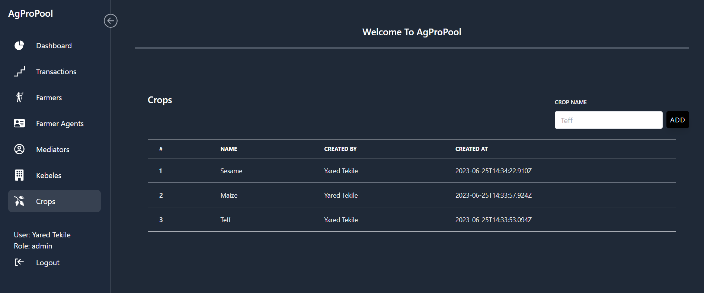

# AgProPool Client

AgProPool is an app that enables kebeles to monitor farmer crop harvesting. Farmer agents will record products from farmers in accordance with their kebele. Farmers, mediators, and an admin panel are all included in this app. Thanks to AgProPool, saving farmers' harvesting data is now simple.

## Functionalities

The project includes the following functionalities:

- Admin, Farmer, farmer agent, and mediator registration.
- Kebele and crop registration.
- Saving transaction data.
- Form error checking
- Storage of user data in local storage
- Checking for private routes
- Checking for public routes
- A responsive user interface that works on a variety of devices.

## Run Locally

Clone the project

```bash
  git clone https://github.com/Yared29/AgProPool-client.git
```

Go to the project directory

```bash
  cd AgProPool-client
```

Install dependencies

```bash
  npm install
```

or

```bash
  yarn
```

To start the app

```bash
  npm run dev
```

or

```bash
  yarn run dev
```

## Tech Stack

**Framework:** React

**Build Tool:** Vite

**Form Library:** Formik

**Form Validation:** Yup

**API Request:** Axios

**CSS framework:** TailwindCss

**State Managment:** Redux Toolkit

## Test Accounts
Use this account to access the live versionRole: 

**Role: Superadmin**

Phone: **0911223344**

Password: **12345678**


**Role: Admin**

Phone: **0929124754**

Password: **12345678**


**Role: Farmer Agent**

Phone: **0955112233**

Password: **12345678**


## Screenshots

| Sign In Page                                        | Dashboard Page                                         |
| --------------------------------------------------- | ------------------------------------------------------ |
|  |  |

| Transaction Page                                          | Farmers Page                                         |
| --------------------------------------------------------- | ---------------------------------------------------- |
|  |  |

| Farmer Agents Page                                         | Mediator                                              |
| ---------------------------------------------------------- | ----------------------------------------------------- |
|  |  |

| Admins Page                                         | Kebeles Page                                         |
| --------------------------------------------------- | ---------------------------------------------------- |
|  |  |

| Crops Page                                         |
| -------------------------------------------------- |
|  |

| Super Admins Sidebar                                        | Admins Sidebar                                        | Farmer Agents Sidebar                                         | Mediators Sidebar                                        |
| ----------------------------------------------------------- | ----------------------------------------------------- | ------------------------------------------------------------- | -------------------------------------------------------- |
|  |  |  |  |

| Add Admin Page                                         | Add Farmer Page                                         |
| ------------------------------------------------------ | ------------------------------------------------------- |
|  |  |

| Add Farmer Agent Page                                         | Add Mediator Page                                         | Add Transaction Page                                         |
| ------------------------------------------------------------- | --------------------------------------------------------- | ------------------------------------------------------------ |
|  |  |  |
